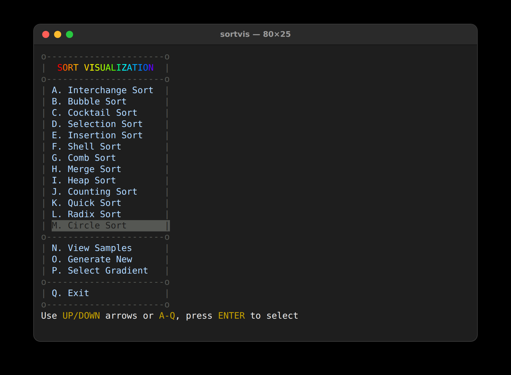
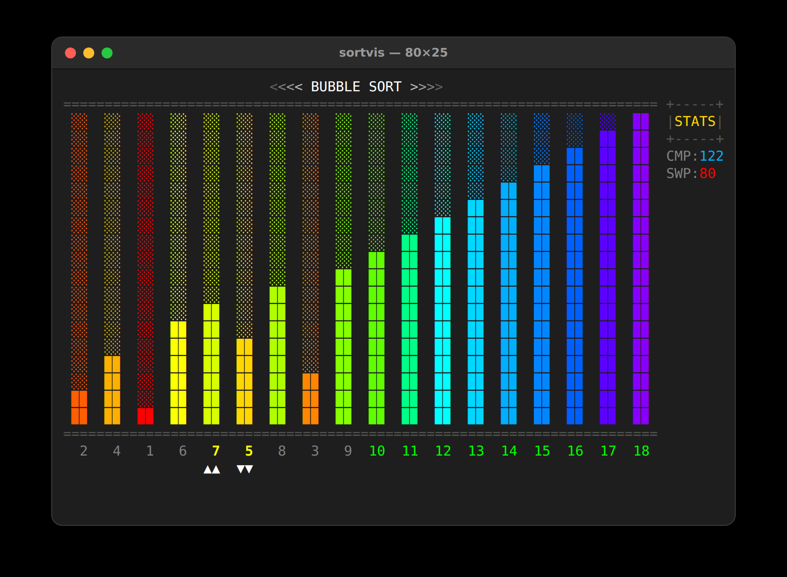
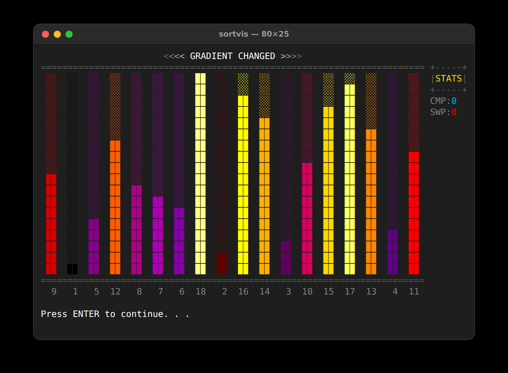

# sortvis
Sort Algorithm Visualizations in the terminal.

SortVis animates 13 sorting algorithms on a set of 18 samples drawn as colored bars,
highlighting the elements being compared and the region already sorted,
and keeping a live count of comparisons and swaps.

## Algorithms
| Key | Algorithm      | Key | Algorithm     |
|-----|----------------|-----|---------------|
| A   | Interchange    | H   | Merge         |
| B   | Bubble         | I   | Heap          |
| C   | Cocktail       | J   | Counting      |
| D   | Selection      | K   | Quick         |
| E   | Insertion      | L   | Radix         |
| F   | Shell          | M   | Circle        |
| G   | Comb           |     |               |

The menu also lets you view the current samples (N), generate new ones (O) that are
randomized, ascending or descending, and pick one of five color gradients (P):
Rainbow, Pastel, Plasma, Inferno and Viridis.

## Building
```bash
make                # or: mingw32-make on Windows
```
or compile directly:
```bash
gcc -O2 -std=c99 sortvis.c -o sortvis
```

## Usage
```
sortvis [OPTIONS]

OPTIONS:
  -v, --version        Display program version information
  -h, --help           Display this help message
  -s, --speed <value>  Set animation speed in milliseconds (default: 60)
```

## Examples
```bash
sortvis              # Run with default settings
sortvis -s 100       # Run with slower animation
sortvis --speed 30   # Run with faster animation
sortvis --help       # Display detailed help
```

## Controls
* `UP`/`DOWN` arrows to move through a menu, `ENTER` to select
* or press the letter of a menu item (`A`-`Q`) to select it directly
* `Q` to exit

While a sort is running, the values being compared are shown in yellow with `▲▲`/`▼▼`
markers below them, and the region the algorithm has already sorted turns green.

## Testing
```bash
make test
```
`test.c` runs every algorithm with the visualization turned off and checks that:
* the output is sorted and contains exactly the values it started with,
  on sorted, reversed, all-equal and thousands of random inputs (with and without duplicates)
* the comparison and swap counters match what each algorithm must do
  (e.g. no swaps on sorted input, Bubble/Cocktail/Insertion swaps equal the number of inversions)
* the sample generators produce valid samples and the random shuffle is unbiased
* the renderer can draw every algorithm without errors

The random inputs use a seed printed at the top of the report; pass it back to reproduce a run:
```bash
./sortvis_test 1234
```

## Screenshots




## Changes
Please see [sortvis.c](sortvis.c)

## Notes
This project was compiled and successfully tested on:
* macOS Tahoe
* Windows 10/11
* Linux (GCC)

**Requirements:**
* Windows 10 Build 10586 or later (for VT/ANSI support)
* macOS or Linux with ANSI terminal support and a UTF-8 locale

**Not compatible with:**
* Windows 7, 8, or 8.1 (no VT terminal support)
